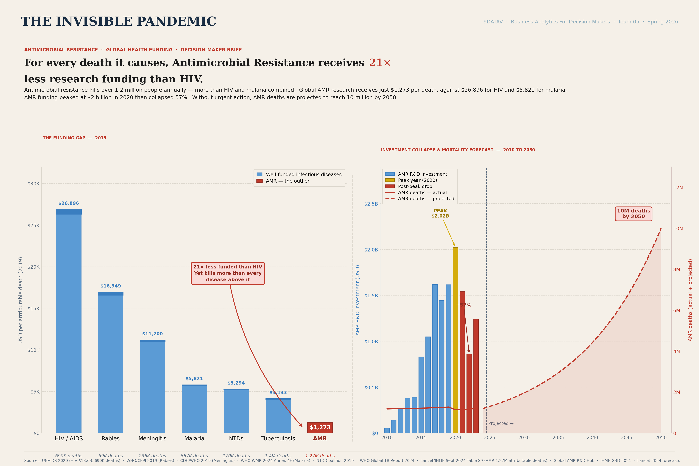
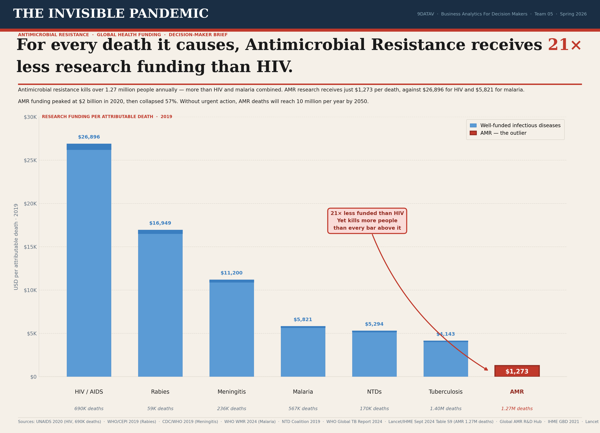

# The Invisible Pandemic — Antimicrobial Resistance Funding

**Antimicrobial resistance (AMR) kills over 1.27 million people a year — more than HIV and malaria combined — yet receives just $1,273 in research funding per death, against $26,896 for HIV. A 21× gap, presented as a decision-maker brief for G7 finance ministers and the WHO.**

A data-visualisation and storytelling project for the 9DATAV *Data Visualisation: Decision-Maker Influence Challenge*, MSc Business Analytics for Decision Makers, National College of Ireland (Spring 2026).

---

## My role & team credit

This was a **team project (Team 05)**. My contribution was leading the **concept, data sourcing, and design direction**. I chose AMR as the subject, framed the central argument (the 21× funding-per-death gap), sourced and interpreted the datasets, and **directed the design of the funding-gap visualisation** — the metric, the sorted-staircase layout, and the two-colour outlier treatment documented below. My teammates contributed to **sourcing and cleaning the datasets** and to building the **interactive dashboard**.

*Tooling note: the final visualisations and the mortality forecast were produced with AI-assisted tooling under the team's direction. I'm currently rebuilding the forecast model independently in Python to own that analysis end-to-end — this repo will be updated when that's complete.*

---

## The headline finding

AMR causes more deaths than HIV, Rabies, Meningitis, Malaria, NTDs and Tuberculosis, yet is funded at a fraction of the rate per death of any of them. The core metric — **research funding per attributable death** — reframes an abstract shortfall as a single, comparable number a busy decision-maker can't forget.



*The fuller analytical view: the funding gap (left) alongside the investment collapse and mortality forecast to 2050 (right). AMR R&D funding peaked at $2.02B in 2020, then fell 57%; on current trends, AMR deaths are projected to reach 10 million per year by 2050.*

The team also produced a **single-chart front-page version**, deliberately stripped to one argument for print — an application of the "one front-page image, understood in ten seconds" brief:



**[View the interactive dashboard →](https://adythio.github.io/amr-dv-dashboard/)**

---

## Why this approach is different

Existing AMR visualisations (the WHO AMR Dashboard, the IHME GBD Browser, the Global AMR R&D Hub Tracker) show raw death counts or raw funding for AMR in isolation. None places AMR *directly against* the diseases that already command political attention, on a like-for-like funding-per-death basis.

Two deliberate choices set this apart. First, **the metric**: pre-computing research funding per attributable death for seven diseases on a common 2019 baseline turns a vague "AMR is underfunded" into a measurable 21× comparison. Second, **the medium**: encoding the finding in a broadsheet newspaper front-page format — a layout G7 ministers already know how to read — removes the learning curve that dashboards impose.

---

## Design decisions (grounded in theory)

Every choice maps to an established visualisation principle:

- **Sorted vertical bar chart** — position on a common scale is the most perceptually accurate encoding (Cleveland & McGill, 1984). Sorting the bars into a descending staircase that ends on AMR turns a neutral list into an argument (Cairo, 2016): *the sorting is the argument.*
- **Two-colour palette** — steel blue for the well-funded diseases, red for AMR alone. Limiting to two colours avoids the "rainbow effect" and reserves red — the most salient colour (Ware, 2004) — for the one thing that matters, so AMR reads as an outlier pre-attentively, before any label is read.
- **Minimal non-data ink** — no borders, faint gridlines only; nearly every pixel encodes data or labels a value (Tufte, 2001).
- **Newspaper typography & layout** — serif masthead for editorial credibility, sans-serif for functional labels (Bringhurst, 2004); the red "21×" is the only colour break in the headline, pre-selecting what the eye lands on (Cairo's "directed reading").

---

## Rejected alternatives

Three designs were explored and deliberately dropped, each for a principled reason:

- **Bubble/scatter chart** — area is a weaker encoding than position (Cleveland & McGill), and it disperses attention across all points rather than forcing focus on AMR.
- **Grouped deaths + funding bars** — made the viewer mentally divide funding by deaths; a chart that requires the reader to "do maths" has failed as communication (Tufte). Pre-computing the ratio solves this.
- **Two-panel bar + forecast** — richer, but forces synthesis of two charts, exceeding working-memory limits for a scan-read front page (Ware). The forecast was moved to the report and dashboard instead — an application of "the smallest effective difference." *(The two-panel view is included above precisely because a repo, unlike a front page, rewards depth.)*

---

## Honest limitations

- **Funding comparability**: HIV's figure reflects total programme spending (treatment, prevention, care), while AMR's is R&D-only — because no global AMR programme exists at scale. The comparison is methodologically imperfect but directionally accurate, and the absence of such a programme is itself part of the story.
- **HIV death count**: UNAIDS 2019 attributable deaths (690K) were used rather than the broader IHME "associated" figure, to stay consistent with the "attributable" definition in the Lancet/IHME AMR paper and avoid inflating the denominator.
- **Snapshot year**: 2019 was chosen as a common baseline (pre-COVID, fully published across sources). AMR funding has since fallen further, so the real gap is now wider than shown — a conservative choice.

---

## Data sources

- **AMR mortality & forecast** — GBD 2021 Antimicrobial Resistance Collaborators (2024), *The Lancet*; IHME Global AMR 1990–2050 dataset
- **HIV** — UNAIDS Global AIDS Update 2020
- **Malaria** — WHO World Malaria Report 2024
- **Tuberculosis** — WHO Global TB Report 2024
- **Meningitis / Rabies / NTDs** — CDC/WHO 2019, WHO/CEPI 2019, NTD Coalition 2019
- **AMR R&D funding** — Global AMR R&D Hub

---

## Repository contents

```
.
├── README.md
├── amr-forecast-full.png     # full analytical view (funding gap + forecast)
├── amr-front-page.png        # single-chart print front-page version
├── dashboard.html            # interactive dashboard (team build)
└── docs/                     # design critique, innovation & principles write-ups
```

---

*Academic team project. Theory references: Tufte (2001), Cairo (2016), Ware (2004), Few (2012), Cleveland & McGill (1984), Bringhurst (2004), Knaflic (2015).*
